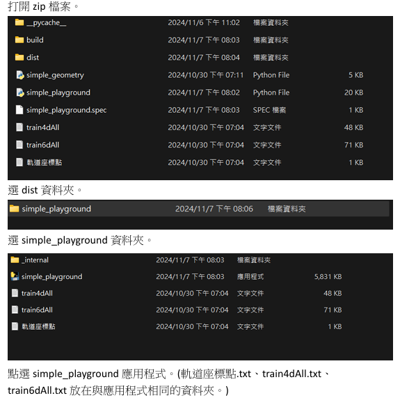

# Self_Drive_Car_MLP
本專案旨在設計一套以人工智慧控制之自走車模擬系統，透過類神經網路模型 (多層感知機MLP) 學習方向盤控制策略，使車輛在封閉跑道中能夠避開邊界並成功抵達終點區域。

使用方式:

點選simple_playground.py

本系統根據題目給定之離散時間車輛運動方程式建立車體運動模型，包含位置更新方程式 
𝑥
(
𝑡
)
,
𝑦
(
𝑡
)
x(t),y(t) 以及車身角度 
𝜙
(
𝑡
)
ϕ(t) 之變化規則。車體初始角度設定為 +90 度，車體直徑為 6 單位。方向盤轉角範圍限制於 ±40 度，並以右轉為正方向。系統僅輸出方向盤角度，其餘狀態變數依運動方程式自動更新。

車體中心配置三組距離感測器，分別偵測正前方及左右各 45 度方向之距離資訊。感測數據作為神經網路之輸入，經由模型推論後輸出對應之方向盤轉角，以控制車輛行進方向。

本專案分別使用兩種訓練資料格式設計神經網路模型：

4D 模型（train4DAll.txt）
輸入：前方距離、右方距離、左方距離
輸出：方向盤角度

6D 模型（train6DAll.txt）
輸入：X 座標、Y 座標、前方距離、右方距離、左方距離
輸出：方向盤角度

模型部分採用自行實作之 多層感知機（MLP），僅使用 NumPy 等基礎數值運算函式庫完成前向傳播與訓練流程，未使用 TensorFlow、PyTorch 等高階 AI 框架。

系統功能包含：

讀取軌道座標並繪製封閉跑道與自走車

動畫顯示車輛行進過程與即時方向

即時顯示三組感測器距離數值

紀錄行駛路徑並輸出 track4D.txt 與 track6D.txt

讀取既有路徑檔進行重播與碰撞偵測

成功抵達終點或發生碰撞時自動停止模擬

實驗結果顯示，透過適當設計之神經網路架構與訓練參數，自走車能夠有效學習轉向控制策略，在不碰撞邊界的情況下順利到達終點。比較 4D 與 6D 模型可分析加入位置資訊對控制穩定性與收斂速度之影響。

本專案整合車輛運動模擬、感測器幾何計算、碰撞偵測、類神經網路設計與圖形化介面開發，完整呈現智慧控制系統之實作流程。
